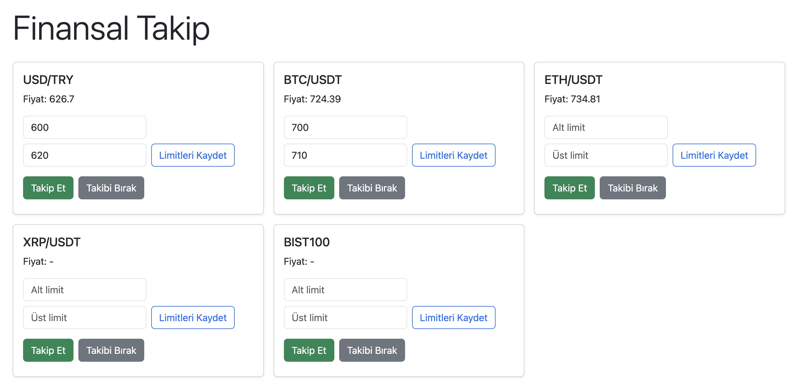

# Finansal Takip Uygulaması (.NET 9 + SignalR)

Bu proje, .NET 9 ve SignalR kullanarak hisse senedi, döviz ve kripto para fiyatlarını gerçek zamanlı izleyebileceğiniz, kullanıcıya özel fiyat limiti bildirimleri ve anlık sistemsel bildirimler sunan bir finansal takip web uygulamasıdır.

---

## Özellikler

- Gerçek zamanlı fiyat güncellemeleri (SignalR ile)
- Kullanıcıya özel fiyat takibi (her kullanıcı sadece takip ettiği sembollerin fiyatını alır)
- Her sembol için alt ve üst fiyat limiti belirleyebilme
- Limit aşımlarında anlık toast mesajı
- Modern ve responsive arayüz (Bootstrap)

---

## Kurulum

1. **Gereksinimler:**
   - .NET 9 SDK
   - macOS, Windows veya Linux

2. **Projeyi Çalıştırma:**

   ```sh
   dotnet restore
   dotnet run
   ```

3. Tarayıcıda `https://localhost:5001` adresine gidin.

---

## Proje Yapısı

```text
Hubs/
  PriceHub.cs           # Fiyat güncellemeleri için SignalR hub
PriceGenerator.cs       # Rastgele fiyat üreten arka plan servisi
Pages/Index.cshtml      # Ana arayüz (Razor Page)
wwwroot/price-client.js # Fiyat güncellemeleri için istemci kodu
```

---

## SignalR Hub Detayları

### 1. PriceHub

Fiyat güncellemelerini ve kullanıcıya özel fiyat takibini yönetir.

- **Subscribe(string symbol):**
  Kullanıcı, bir sembolü takip etmek istediğinde çağrılır. Kullanıcıya özel olarak takip edilen semboller sunucu tarafında saklanır.

- **Unsubscribe(string symbol):**
  Kullanıcı, bir sembolü takipten çıkmak istediğinde çağrılır.

- **OnDisconnectedAsync:**
  Kullanıcı bağlantısı koptuğunda temizlik işlemleri yapılır.

- **SendPriceUpdateToSubscribers:**
  PriceGenerator tarafından çağrılır. Sadece ilgili sembolü takip eden kullanıcılara fiyat güncellemesi gönderir.

#### Kullanıcıya Özel Fiyat Takibi

Her kullanıcı sadece takip ettiği sembollerin fiyat güncellemelerini alır. Takip edilen semboller sunucu tarafında `ConcurrentDictionary` ile saklanır. Bu sayede gereksiz veri trafiği önlenir ve kullanıcıya özel deneyim sağlanır.

#### Koddan Örnek:

```csharp
public Task Subscribe(string symbol) { ... }
public static async Task SendPriceUpdateToSubscribers(...) { ... }
```

---

#### Kullanım Senaryoları

- Sistemsel duyuru, haber, bakım bildirimi
- Kullanıcıya özel bir olay (ör. fiyat alarmı, emir gerçekleşti)
- Tüm kullanıcılara toplu mesaj

---

## Fiyat Limiti ve Bildirimler

- Her sembol için alt ve üst fiyat limiti belirlenebilir.
- Fiyat limiti aşıldığında istemci tarafında toast mesajı gösterilir.

---

## İstemci Kodları

- `price-client.js`: SignalR ile fiyat güncellemelerini alır, kartlarda gösterir, limit kontrollerini yapar.

---

## Genişletilebilirlik

- Yeni hub ekleyerek canlı sohbet, emir yönetimi, haber yayını gibi özellikler eklenebilir.
- Kimlik doğrulama ve yetkilendirme ile güvenlik artırılabilir.

---

## Ekran Görüntüsü



---

## Katkı ve Lisans

Açık kaynak, dilediğiniz gibi geliştirebilir ve kullanabilirsiniz.
